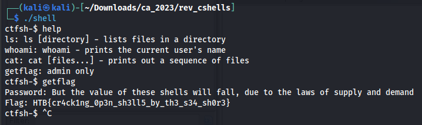

1. On exécute le programme, c'est une sorte de shell
2. On ouvre avec Ghidra
3. dans les **defined strings** on trouve "flag: %s", on suit la XREF pour aller dans la bonne fonction

4. First thing first I changed the type of **local_118** cause it's obviously a variable of 32 chars
5. **local_118** is probably (certainly) the flag, we can see the var is full of 0 at the beginning.
6. Then we have a loop xoring each char of the flag variable with the char at **m1**
7. We see a call to **memcmp** which copy the variable **t** on our flag variable
8. Then in a second loop we notice the xoring of the variable with **m2**
9. I begin by extracting the values of **m1**, **m2** and **t** as a python list
10. And I write a little script to xor the different value and get the password, at first I though I would get the flag but no I get the password
11. After executing the **solve.py** we have the password and we get give it to the shell.
